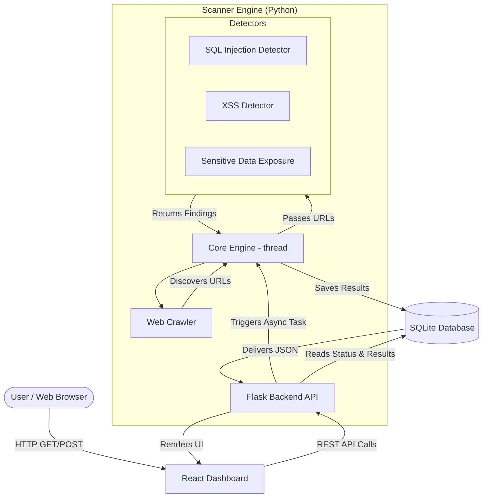

# SecureScan Project Documentation

## 1. System Architecture Diagram



## 2. Database Schema (SQLite)

The system uses a lightweight local SQLite database to persist scan state and historical findings.

### Tables:

**1. `scans`** (Tracks every scan attempt)
- `id` (INTEGER, Primary Key)
- `target_url` (TEXT)
- `status` (TEXT) - e.g., 'running', 'completed', 'error'
- `started_at` (DATETIME)
- `completed_at` (DATETIME)

**2. `pages`** (Stores links discovered by the crawler)
- `id` (INTEGER, Primary Key)
- `scan_id` (INTEGER, Foreign Key -> scans.id)
- `url` (TEXT)

**3. `vulnerabilities`** (Stores actionable findings)
- `id` (INTEGER, Primary Key)
- `scan_id` (INTEGER, Foreign Key -> scans.id)
- `type` (TEXT) - e.g., 'SQL Injection', 'Sensitive Data'
- `url` (TEXT) - Where it was found
- `parameter` (TEXT) - The query argument tested
- `payload` (TEXT) - The injected malicious string
- `severity` (TEXT) - 'High', 'Medium', 'Low'
- `description` (TEXT) - Remediation/Evidence details

## 3. Folder Structure

```text
securescan/
├── frontend/
│   ├── src/
│   │   ├── App.jsx            # Main React UI Dashboard
│   │   ├── api.js             # API polling and data fetching methods
│   │   └── ... 
│   ├── package.json
│   └── vite.config.js
└── backend/
    ├── api/
    ├── core/
    │   └── engine.py          # Master orchestrator for scan threads
    ├── crawler/
    │   └── crawler.py         # BeautifulSoup spider module
    ├── detectors/
    │   ├── sensitive_data.py  # Regex scanning for keys/emails
    │   ├── sqli.py            # SQL error signature detection
    │   └── xss.py             # Reflected XSS active testing
    ├── reports/
    │   └── report.py          # Logic for formatting JSON and Text outputs
    ├── app.py                 # Flask REST server
    ├── database.py            # SQLite helper routines
    ├── scanner.py             # Basic security headers detector
    └── requirements.txt
```

## 4. Tech Stack Justification (For Viva)

**Why React/Vite for the Frontend?**
- Allows for a dynamic SPA (Single Page Application) experience.
- The state management (using `useState`/`useEffect`) is perfect for handling asynchronous scan polling (`setInterval`) without forcing full page reloads. It delivers a modern user experience with smooth dashboard updates.

**Why Python (Flask) for the Backend?**
- Python is the undisputed king of cybersecurity scripting. Libraries like `requests` and `beautifulsoup4` make HTTP manipulation and HTML parsing trivial compared to Node.js.
- Flask is lightweight and modular. We didn't need a heavy framework like Django because we just needed a REST API layer on top of our custom scanning engine.

**Why SQLite?**
- Zero-configuration. It requires no separate background database server process (like MySQL/Postgres), making the tool highly portable and easy to run locally.

**Why Concurrent Futures (Threading) vs Multiprocessing?**
- Network requests are I/O bound, not CPU bound. Threads are extremely efficient for waiting on HTTP responses, allowing us to scan multiple URLs concurrently without spiking CPU usage. 

---

## 5. Viva Preparation (Q & A)

**Q1: How does your Web Crawler ensure it doesn't scan the entire internet?**
*Answer:* The crawler parses the hostname of the starting URL and strictly checks that any newly discovered `href` tags belong to that exact same domain. Fragments (`#`) are stripped, and a `max_depth` parameter forcefully halts the spider if it goes too deep (e.g., depth of 2).

**Q2: How exactly does the SQL Injection detector work in your project?**
*Answer:* It intercepts URL query parameters (e.g., `?id=1`), and appends common break characters like `'` or `" OR "1"="1`. It then searches the raw HTML response body for common database syntax errors like "mysql error" or "unclosed quotation mark". If it finds one, the input is vulnerable.

**Q3: How are you handling Long-Running Scans? Users can't just stare at a loading screen.**
*Answer:* The architecture is asynchronous. When a user clicks "Start Scan", Flask spins up a background Python thread to run the `ScannerEngine` and immediately returns a `202 Accepted` to the frontend. The React frontend then begins polling a `GET /api/scan/status` endpoint every 3 seconds until SQLite reports the scan is "completed", at which point it fetches the final results.

**Q4: Is it safe to run this on any website?**
*Answer:* I have implemented Server-Side Request Forgery (SSRF) protections in `security.py`. It blocks scanning `localhost` and internal IP addresses from the web dashboard. However, for active payloads (like SQLi/XSS), we must *only* scan environments we have explicit permission for, such as local Docker instances of DVWA or OWASP Juice Shop.

**Q5: How did you implement Sensitive Data Exposure detection?**
*Answer:* I used Python's `re` (RegEx) module to scan the entire text payload of the HTTP response against known patterns for India Phone Numbers, Email Addresses, and Cloud API Keys (like AWS/Stripe).
